  

  

  <strong>ML-powered item build recommendations for Valve’s Deadlock.</strong>

  <a href="https://datalock.dev">Live Site</a> ·
  <a href="https://deadlock-api.com/">Deadlock API</a>

## About
DataLock is a context-aware item recommender for Valve’s Deadlock. Select your hero, allies, enemies, and game phase to receive ranked item suggestions predicted to improve your chances of winning. Instead of static build guides, DataLock adapts recommendations to the lobby you are actually in, using an ML model trained on large-scale community match data.

Recommendations are enriched with item metadata and shop images, then presented in a clean, fast UI that makes it easy to compare options and lock in a build.

  

## How It Works

DataLock is split into three layers: a fast UI for selecting match context, a serverless inference API for ranking items, and a private model bundle that keeps the ML artifacts and metadata secure.

**1) UI collects match context (Vercel, Next.js)**  
You select your hero, allies, enemies, and a game phase (early, mid, late). The UI is intentionally lightweight so the interaction feels instant and the recommendation flow is easy to understand.

**2) Requests are routed server-side to protect secrets (Next.js API routes)**  
The browser never talks to AWS directly. Instead, the Next.js server routes forward requests to the inference API and attach an `x-api-key` from environment variables. This keeps the API key out of client-side code and prevents it from being scraped from network requests.

**3) Serverless inference runs on AWS Lambda (Python)**  
The AWS HTTP API triggers a Python Lambda handler which:
- validates the request payload (hero IDs, phase, team sizes)
- transforms the match context into a fixed-order feature vector (using versioned metadata)
- scores candidate items using an XGBoost model trained on large-scale match outcomes
- returns a ranked list of items with scores and item metadata for display

**4) Model assets are loaded from private S3 and cached for speed**  
The inference bundle (models + feature ordering + item/hero metadata) lives in a private S3 bucket. On cold start, Lambda downloads the bundle once, then caches it in `/tmp` and process-level globals so subsequent invocations reuse the assets without repeated S3 fetches. This reduces latency and cost while keeping the artifacts private.

**5) Optional caching for repeated matchups (DynamoDB)**  
For identical contexts (same hero, allies, enemies, phase), DynamoDB can cache the response. This avoids recomputing rankings for common matchups and makes repeated requests consistently fast.

**6) Results are rendered as a build shortlist (Next.js UI)**  
The frontend renders the ranked recommendations as item cards using the returned metadata (names and shop images). The goal is to make the output feel like a usable build shortlist rather than a raw model score dump.

## Architecture Diagram

```mermaid
flowchart TD
  %% =========================
  %% DataLock High Level System
  %% =========================

  %% Frontend (Next.js on Vercel)
  subgraph "Frontend (Next.js 16 on Vercel)"
    direction TB
    FE_Page["src/app/page.tsx"]:::frontend
    FE_Layout["src/app/layout.tsx"]:::frontend
    FE_Styles["src/app/globals.css"]:::frontend

    subgraph "Server-side API Routes (hide x-api-key)"
      direction TB
      FE_API_Heroes["src/app/api/heroes/route.ts"]:::frontend
      FE_API_Metadata["src/app/api/metadata/route.ts"]:::frontend
      FE_API_Recommend["src/app/api/recommend/route.ts"]:::frontend
      FE_Lib["src/lib/api.ts"]:::frontend
      FE_Types["src/types/deadlock.ts"]:::frontend
    end
  end

  %% AWS Inference Backend
  subgraph "AWS Backend (HTTP API Gateway -> Lambda)"
    direction TB
    APIGW["API Gateway (HTTP API)\n/recommend /heroes /metadata"]:::aws

    subgraph "Lambda (Python 3.11)"
      direction TB
      LH["backend/src/deadlock_backend/deploy/lambda_handler.py"]:::backend
      IC["backend/src/deadlock_backend/inference/inference_core.py"]:::backend
      CFG["backend/src/deadlock_backend/config.py"]:::backend
      TMP["/tmp cache + module globals\n(warm reuse)"]:::backend
    end

    subgraph "Logs"
      direction TB
      CW["CloudWatch Logs + Alarm"]:::aws
    end

    subgraph "Private Model Assets"
      direction TB
      S3["S3 (private)\nmodel bundle + hero_assets + metadata"]:::storage
    end
  end

  %% Offline training / export pipeline (runs outside request path)
  subgraph "Offline Training + Bundle Export (local or CI runner)"
    direction TB
    NB["backend/notebooks/training_pipeline.ipynb"]:::pipeline
    PIPE["backend/run_pipeline.py"]:::pipeline

    subgraph "Export Scripts"
      direction TB
      EX_BUNDLE["backend/src/deadlock_backend/exports/export_inference_bundle.py"]:::pipeline
      EX_HERO["backend/src/deadlock_backend/exports/export_hero_assets.py"]:::pipeline
      EX_META["backend/src/deadlock_backend/exports/export_model_metadata.py"]:::pipeline
    end

    DW["Deadlock Parquet snapshots\n(S3 dump)"]:::external
    DUCK["DuckDB\nfeature tables + joins"]:::pipeline
    XGB["XGBoost training\n(early/mid/late/etc)"]:::pipeline
  end

  %% External Entities
  User["User (Browser)"]:::external
  GA["GA4 (analytics events)"]:::external

  %% =========================
  %% Runtime Request Flow
  %% =========================
  User -->|"HTTPS"| FE_Page
  FE_Page -->|"fetch /api/* (server-side)"| FE_API_Recommend
  FE_API_Recommend -->|"HTTPS + x-api-key\nPOST /recommend"| APIGW
  FE_API_Heroes -->|"HTTPS + x-api-key\nGET /heroes"| APIGW
  FE_API_Metadata -->|"HTTPS + x-api-key\nGET /metadata"| APIGW

  APIGW -->|"Invoke"| LH
  LH -->|"Cold start fetch"| S3
  LH -->|"Warm reuse"| TMP
  LH -->|"Logs/metrics"| CW
  FE_Page -->|"analytics"| GA

  %% =========================
  %% Training + Export Flow
  %% =========================
  DW -->|"Read snapshots"| DUCK
  NB -->|"Drive pipeline"| PIPE
  PIPE -->|"Build features"| DUCK
  DUCK -->|"Train"| XGB
  XGB -->|"Export artifacts"| EX_BUNDLE
  XGB -->|"Export metadata"| EX_META
  EX_HERO -->|"Upload hero assets"| S3
  EX_META -->|"Upload model metadata"| S3
  EX_BUNDLE -->|"Upload inference bundle"| S3

  %% =========================
  %% Styles
  %% =========================
  classDef frontend fill:#B3E5FC,stroke:#0288D1,color:#000;
  classDef backend fill:#C8E6C9,stroke:#388E3C,color:#000;
  classDef aws fill:#E1BEE7,stroke:#6A1B9A,color:#000;
  classDef storage fill:#FFE0B2,stroke:#F57C00,color:#000;
  classDef pipeline fill:#D7CCC8,stroke:#5D4037,color:#000;
  classDef external fill:#E0E0E0,stroke:#9E9E9E,color:#000;

```

